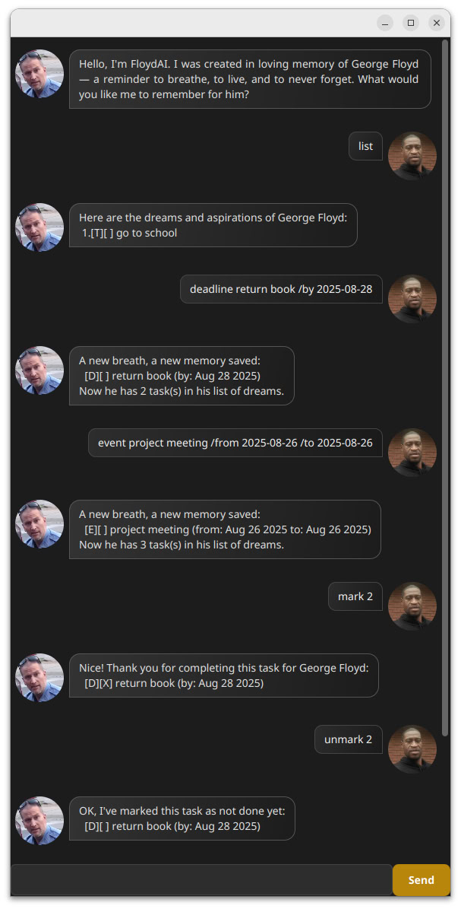

# FloydAI User Guide



This document provides instructions for using FloydAI, a desktop application for task management and interactive AI responses.


FloydAI is more than just a task manager chatbot. It’s a personal tribute to George Floyd and to all the lives lost too soon to systemic racism and police brutality.

This bot represents the things George Floyd could have achieved, remembered, or dreamed of doing if his life had not been cut short. Each todo, each deadline, and each event is a reminder of how precious time is, and how easily it can be stolen.

### Why FloydAI?
- To keep alive the words “I can’t breathe” as a call for justice 🕊️
- To reflect on lost potential and the importance of making every moment count
- To show that even in code, we can create spaces that honor memory and meaning

---

## Adding Deadlines

FloydAI supports creating tasks with deadlines. Use the `deadline` command followed by the task description and the `/by` argument to specify the due date.

**Syntax:**
```text
deadline <task description> /by <yyyy-MM-dd>
```

**Example:**
```text
deadline return book /by 2025-08-28
```

**Expected outcome:**
- The task “return book” is added to the task list with a due date of 28th August 2025.
- FloydAI confirms the addition with a message in the chat window.

---

## Adding Events

You can add events with start and end dates using the `event` command with `/from` and `/to` arguments.

**Syntax:**
```text
event <event description> /from <yyyy-MM-dd> /to <yyyy-MM-dd>
```

**Example:**
```text
event project meeting /from 2025-08-26 /to 2025-08-26
```

**Expected outcome:**
- The event “project meeting” is added with the specified start and end dates.
- FloydAI displays confirmation in the chat window.

---

## Listing Tasks

To see all tasks and events in your task list, use the `list` command:

**Command:**
```text
list
```

**Expected outcome:**
- FloydAI lists all tasks and events with their status, numbers, and dates if applicable.

---

## Marking and Unmarking Tasks

To mark a task as done:

**Syntax:**  
```text
mark <task number>
```

To mark a task as not done:

**Syntax:**  
```text
unmark <task number>
```

**Example:**  
```text
mark 2
unmark 2
```

**Expected outcome:**
- The status of the task number specified is updated accordingly.
- FloydAI confirms the status change in the chat window.

---

## Deleting Tasks

To remove a task from the list, use the `delete` command:

**Syntax:**  
```text
delete <task number>
```

**Example:**  
```text
delete 1
```


**Expected outcome:**
- Task number 1 is removed from the task list.
- FloydAI confirms the deletion in the chat window.

---

## Exiting FloydAI

To close the application:

**Command:**  
```text
bye
```


**Expected outcome:**
- FloydAI thanks the user and closes the application window.

---

## Tips

- Ensure that all dates follow the `yyyy-MM-dd` format.
- The GUI will automatically scroll to show the most recent dialog.
- For clarity, always provide task numbers when marking, unmarking, or deleting tasks.
- Use descriptive task and event names to keep your task list organized.
